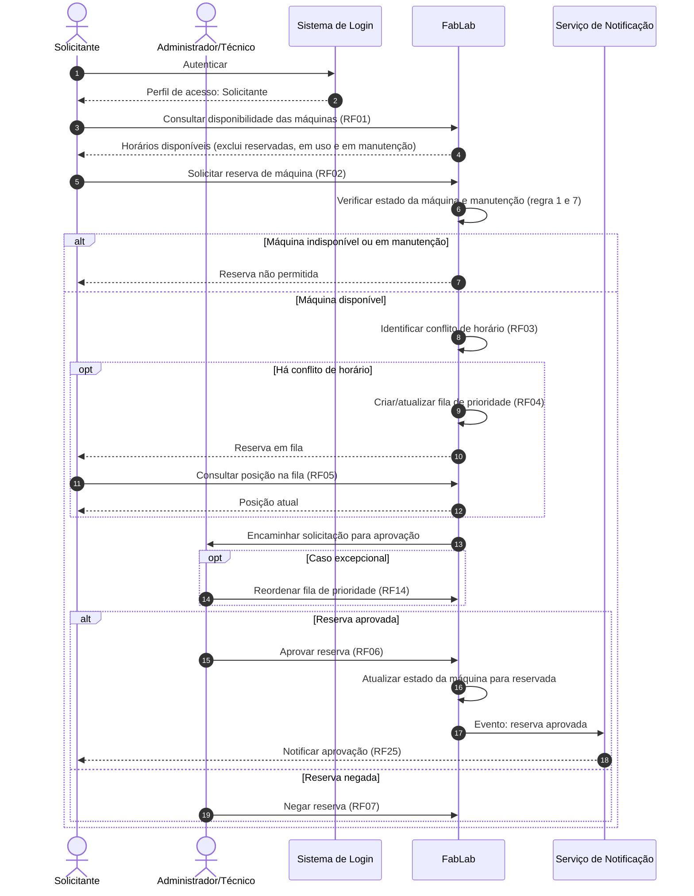
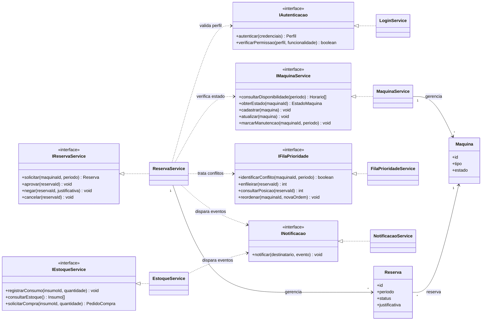

```mermaid
sequenceDiagram
autonumber
actor Sol as Solicitante
actor Adm as Administrador/Técnico
participant Login as Sistema de Login
participant Fab as FabLab
participant Not as Serviço de Notificação

Sol->>Login: Autenticar
Login-->>Sol: Perfil de acesso: Solicitante

Sol->>Fab: Consultar disponibilidade das máquinas (RF01)
Fab-->>Sol: Horários disponíveis (exclui reservadas, em uso e em manutenção)

Sol->>Fab: Solicitar reserva de máquina (RF02)
Fab->>Fab: Verificar estado da máquina e manutenção (regra 1 e 7)

alt Máquina indisponível ou em manutenção
    Fab-->>Sol: Reserva não permitida
else Máquina disponível
    Fab->>Fab: Identificar conflito de horário (RF03)

    opt Há conflito de horário
        Fab->>Fab: Criar/atualizar fila de prioridade (RF04)
        Fab-->>Sol: Reserva em fila
        Sol->>Fab: Consultar posição na fila (RF05)
        Fab-->>Sol: Posição atual
    end

    Fab->>Adm: Encaminhar solicitação para aprovação

    opt Caso excepcional
        Adm->>Fab: Reordenar fila de prioridade (RF14)
    end

    alt Reserva aprovada
        Adm->>Fab: Aprovar reserva (RF06)
        Fab->>Fab: Atualizar estado da máquina para reservada
        Fab->>Not: Evento: reserva aprovada
        Not-->>Sol: Notificar aprovação (RF25)
    else Reserva negada
        Adm->>Fab: Negar reserva (RF07)
        %% >>> cole aqui o restante do seu diagrama <<<
    end
end
```

## 2. Diagrama de Interfaces

```mermaid
classDiagram
direction LR

class IAutenticacao {
    <<interface>>
    +autenticar(credenciais) Perfil
    +verificarPermissao(perfil, funcionalidade) boolean
}

class IMaquinaService {
    <<interface>>
    +consultarDisponibilidade(periodo) Horario[]
    +obterEstado(maquinaId) EstadoMaquina
    +cadastrar(maquina) void
    +atualizar(maquina) void
    +marcarManutencao(maquinaId, periodo) void
}

class IReservaService {
    <<interface>>
    +solicitar(maquinaId, periodo) Reserva
    +aprovar(reservaId) void
    +negar(reservaId, justificativa) void
    +cancelar(reservaId) void
}

class IFilaPrioridade {
    <<interface>>
    +identificarConflito(maquinaId, periodo) boolean
    +enfileirar(reservaId) int
    +consultarPosicao(reservaId) int
    +reordenar(maquinaId, novaOrdem) void
}

class INotificacao {
    <<interface>>
    +notificar(destinatario, evento) void
}

class IEstoqueService {
    <<interface>>
    +registrarConsumo(insumoId, quantidade) void
    +consultarEstoque() Insumo[]
    +solicitarCompra(insumoId, quantidade) PedidoCompra
}

class LoginService
class MaquinaService
class ReservaService
class FilaPrioridadeService
class NotificacaoService
class EstoqueService

class Reserva {
    +id
    +periodo
    +status
    +justificativa
}

class Maquina {
    +id
    +tipo
    +estado
}

IAutenticacao <|.. LoginService
IMaquinaService <|.. MaquinaService
IReservaService <|.. ReservaService
IFilaPrioridade <|.. FilaPrioridadeService
INotificacao <|.. NotificacaoService
IEstoqueService <|.. EstoqueService

ReservaService ..> IMaquinaService : verifica estado
ReservaService ..> IFilaPrioridade : trata conflitos
ReservaService ..> INotificacao : dispara eventos
ReservaService ..> IAutenticacao : valida perfil
EstoqueService ..> INotificacao : dispara eventos

ReservaService "1" --> "*" Reserva : gerencia
MaquinaService "1" --> "*" Maquina : gerencia
Reserva "*" --> "1" Maquina : reserva
```
