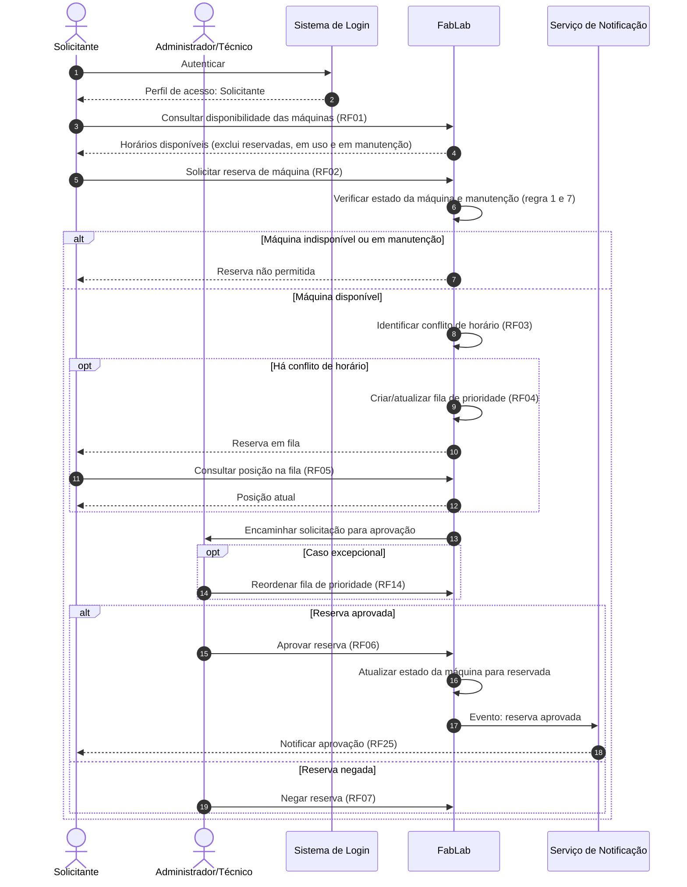

```mermaid
sequenceDiagram
autonumber
actor Sol as Solicitante
actor Adm as Administrador/Técnico
participant Login as Sistema de Login
participant Fab as FabLab
participant Not as Serviço de Notificação

Sol->>Login: Autenticar
Login-->>Sol: Perfil de acesso: Solicitante

Sol->>Fab: Consultar disponibilidade das máquinas (RF01)
Fab-->>Sol: Horários disponíveis (exclui reservadas, em uso e em manutenção)

Sol->>Fab: Solicitar reserva de máquina (RF02)
Fab->>Fab: Verificar estado da máquina e manutenção (regra 1 e 7)

alt Máquina indisponível ou em manutenção
    Fab-->>Sol: Reserva não permitida
else Máquina disponível
    Fab->>Fab: Identificar conflito de horário (RF03)

    opt Há conflito de horário
        Fab->>Fab: Criar/atualizar fila de prioridade (RF04)
        Fab-->>Sol: Reserva em fila
        Sol->>Fab: Consultar posição na fila (RF05)
        Fab-->>Sol: Posição atual
    end

    Fab->>Adm: Encaminhar solicitação para aprovação

    opt Caso excepcional
        Adm->>Fab: Reordenar fila de prioridade (RF14)
    end

    alt Reserva aprovada
        Adm->>Fab: Aprovar reserva (RF06)
        Fab->>Fab: Atualizar estado da máquina para reservada
        Fab->>Not: Evento: reserva aprovada
        Not-->>Sol: Notificar aprovação (RF25)
    else Reserva negada
        Adm->>Fab: Negar reserva (RF07)
        %% >>> cole aqui o restante do seu diagrama <<<
    end
end
```